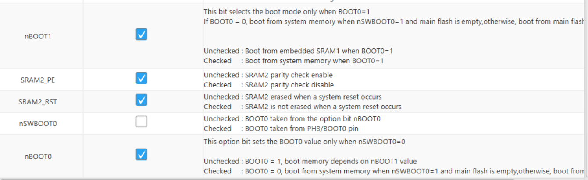

# Aeon

Aeon is a solar-powered colour e-ink photo frame. See the [blogpost](https://insertnewline.com/blog/aeon/) for a full write-up.

This repository contains the following design files for Aeon. 

- [Firmware](firmware)
- [Image Conversion Script](image_conversion)
- [Schematic and PCB Design](schematic_and_PCB)

See the the [blogpost](https://insertnewline.com/blog/aeon/) for additional file downloads.

## Firmware

The `/firmware` directory contains the firmware for the STM32 microcontroller.

### Flashing

Before flashing the firmware, the option bytes of the STM32 must be set. Using STM32CubeProgrammer, uncheck nSWBOOT0. The option byte options should look like this:

Next, flashing the firmware can be done using the STM32CubeIDE. Your STLink programmer should be connected to the programming pins on the PCB.

### Debugging

The firmware includes several debugging features. 

Any `printf` statements will be outputted to SWO, which can be read using STLink. Additionally, if debug mode is active, any logged data will be stored in an array, and written to the SD card just before going back to sleep. This debug mode is enabled by pressing and **holding** the refresh button to wake the device. The status LED will **flash rapidly** to indicate debug mode is active. Alternatively, the `DEBUG_MODE_FORCE_EN` flag in `main.h` forces debug mode to be enabled. This should be disabled during normal operation to prevent excessive SD card writes.

The `BATT_LOGGING` flag in logs to `/logfiles/batt-charge.csv` on the SD card. This only appends a new line to the file on each wake cycle, so it is safe to leave on for extended periods of time.

### ADC Calibration

The ADC for the battery voltage measurement should be calibrated as the accuracy of different STM32 chips can vary. The calibration process must be done manually by changing [this](/firmware/Core/Src/aeon.c#L108) value in the `aeon.c` file.

## Image Conversion

The `/image_conversion` folder contains a Python script to convert images to the SLIC format, which is the image format Aeon supports. 

### Preparation

Compile the photos you wish to display on Aeon, and save them in a directory. `.jpg`, `.png` and `.heic` files are supported. All images should be the same orientation. If a portrait orientation is chosen, rotate all portrait images 90 degrees clockwise. 

### Usage Instructions

The first step is preparing the SLIC conversion executable.

1. Git clone the SLIC repository `git clone https://github.com/bitbank2/SLIC.git`
2. Change directory `cd SLIC/linux/c_demo/`
3. Compile executable with `make`
4. Copy the executable to the `/image_conversion` directory

Next, install the required Python packages with `pip install -r requirements.txt`.

To convert a directory of images, run `python convert.py <input_dir>` where `<input_dir>` is the directory containing the images to convert. The converted images will be saved in a new directory named `img_out`.

The generated `.slc` files can then be copied to the `/images` directory of the SD card. *Do not rename the generated files.*

## Schematic and PCB Design

The `/schematic_and_PCB` directory contains the KiCad schematic and PCB design files for Aeon.